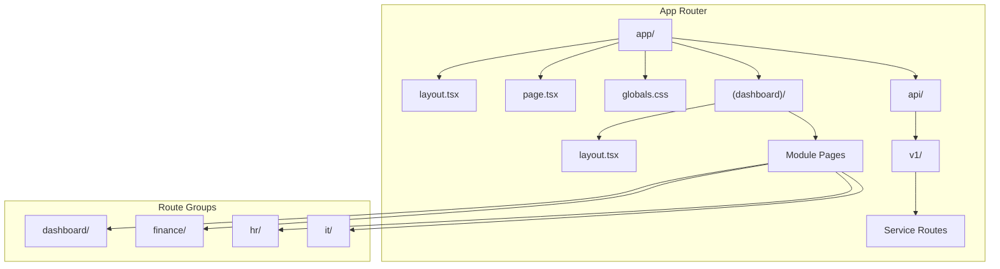
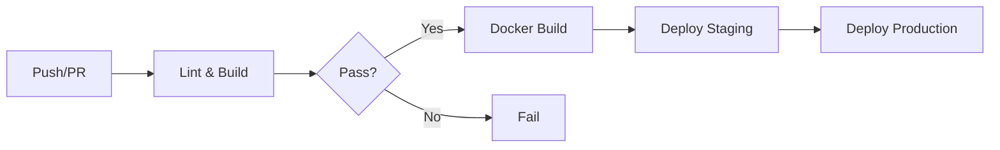

# GoApps Frontend

Frontend application for **GoApps Platform** built with Next.js 16, React 19, and modern web technologies.

---

## 📋 Table of Contents

1. [Overview](#overview)
2. [Technology Stack](#technology-stack)
3. [Architecture](#architecture)
4. [Repository Structure](#repository-structure)
5. [Quick Start](#quick-start)
6. [Development](#development)
7. [Components](#components)
8. [State Management](#state-management)
9. [API Integration](#api-integration)
10. [Styling](#styling)
11. [Testing](#testing)
12. [CI/CD Pipeline](#cicd-pipeline)
13. [Deployment](#deployment)
14. [Troubleshooting](#troubleshooting)
15. [Related Documentation](#related-documentation)

---

## Overview

This repository contains the frontend web application for the GoApps platform. It provides a modern, responsive dashboard for managing enterprise operations across multiple modules.

### GoApps Ecosystem

```
goapps/
├── goapps-frontend/       # 🌐 Frontend application (this repo)
├── goapps-backend/        # 🖥️  Backend microservices
├── goapps-infra/          # 🔧 Infrastructure as Code
└── goapps-shared-proto/   # 📝 Protocol Buffer definitions
```

| Repository | Description | Tech Stack |
|------------|-------------|------------|
| `goapps-frontend` | Web Application | Next.js 16, React 19, TailwindCSS 4, shadcn/ui |
| `goapps-backend` | Microservices APIs | Go 1.24, gRPC, PostgreSQL |
| `goapps-infra` | Infrastructure as Code | Kubernetes, ArgoCD, Helm |
| `goapps-shared-proto` | API Contracts | Protocol Buffers, Buf |

### Application Modules

| Module | Path | Description |
|--------|------|-------------|
| Dashboard | `/dashboard` | Main dashboard with metrics |
| Finance | `/finance/*` | Financial management (UOM, Costing) |
| HR | `/hr/*` | Human resources (planned) |
| IT | `/it/*` | IT management (planned) |
| CI | `/ci/*` | Continuous improvement (planned) |
| EXSIM | `/exsim/*` | Export/Import management (planned) |

---

## Technology Stack

### Core Framework

| Technology | Version | Description |
|------------|---------|-------------|
| Next.js | 16.1.6 | React framework with App Router |
| React | 19.2.3 | UI library |
| TypeScript | 5.x | Type-safe JavaScript |

### UI & Styling

| Technology | Version | Description |
|------------|---------|-------------|
| TailwindCSS | 4.x | Utility-first CSS |
| shadcn/ui | latest | UI component library (new-york style) |
| Radix UI | various | Accessible primitives |
| Lucide React | 0.563.0 | Icon library |
| Recharts | 2.15.4 | Chart components |

### State & Data

| Technology | Version | Description |
|------------|---------|-------------|
| TanStack Query | 5.90.20 | Server state management |
| Zustand | 5.0.10 | Client state management |
| Zod | 4.3.6 | Schema validation |
| React Hook Form | 7.71.1 | Form handling |

### API Communication

| Technology | Version | Description |
|------------|---------|-------------|
| @grpc/grpc-js | 1.14.3 | gRPC client |
| @grpc/proto-loader | 0.8.0 | Proto file loader |

### Development

| Tool | Description |
|------|-------------|
| ESLint | Code linting |
| TypeScript | Type checking |
| PostCSS | CSS processing |

---

## Architecture

### Application Architecture

```
┌──────────────────────────────────────────────────────────────────────────────┐
│                            Next.js Frontend                                   │
├──────────────────────────────────────────────────────────────────────────────┤
│                                                                              │
│  ┌────────────────────────────────────────────────────────────────────────┐  │
│  │                         BROWSER (Client)                               │  │
│  │                                                                        │  │
│  │  ┌─────────────┐  ┌─────────────┐  ┌─────────────┐                    │  │
│  │  │   React     │  │  TanStack   │  │   Zustand   │                    │  │
│  │  │ Components  │  │   Query     │  │    Store    │                    │  │
│  │  └──────┬──────┘  └──────┬──────┘  └──────┬──────┘                    │  │
│  └─────────┼────────────────┼────────────────┼───────────────────────────┘  │
│            │                │                │                               │
│            ▼                ▼                ▼                               │
│  ┌────────────────────────────────────────────────────────────────────────┐  │
│  │                         NEXT.JS SERVER                                 │  │
│  │                                                                        │  │
│  │  ┌─────────────┐  ┌─────────────┐  ┌─────────────┐                    │  │
│  │  │   Pages     │  │ API Routes  │  │   Server    │                    │  │
│  │  │   (SSR)     │  │   (/api)    │  │ Components  │                    │  │
│  │  └──────┬──────┘  └──────┬──────┘  └──────┬──────┘                    │  │
│  └─────────┼────────────────┼────────────────┼───────────────────────────┘  │
│            │                │                │                               │
│            │    BFF Pattern │                │                               │
│            ▼                ▼                ▼                               │
│  ┌────────────────────────────────────────────────────────────────────────┐  │
│  │                       gRPC CLIENT LAYER                                │  │
│  │                                                                        │  │
│  │  ┌─────────────────────────────────────────────────────────────────┐   │  │
│  │  │                     @grpc/grpc-js                               │   │  │
│  │  │            (Server-side gRPC calls to backend)                  │   │  │
│  │  └────────────────────────────┬────────────────────────────────────┘   │  │
│  └───────────────────────────────┼────────────────────────────────────────┘  │
│                                  │                                           │
│                                  ▼                                           │
│  ┌────────────────────────────────────────────────────────────────────────┐  │
│  │                     BACKEND MICROSERVICES                              │  │
│  │                                                                        │  │
│  │  ┌─────────────┐  ┌─────────────┐  ┌─────────────┐                    │  │
│  │  │   Finance   │  │     IAM     │  │    Other    │                    │  │
│  │  │   Service   │  │   Service   │  │  Services   │                    │  │
│  │  │  :50051     │  │   :50052    │  │   :5005x    │                    │  │
│  │  └─────────────┘  └─────────────┘  └─────────────┘                    │  │
│  └────────────────────────────────────────────────────────────────────────┘  │
└──────────────────────────────────────────────────────────────────────────────┘
```

### Next.js App Router Structure



---

## Repository Structure

```
goapps-frontend/
│
├── 📁 src/
│   ├── 📁 app/                      # Next.js App Router
│   │   ├── (dashboard)/             # Dashboard route group
│   │   │   ├── layout.tsx           # Dashboard layout with sidebar
│   │   │   ├── dashboard/           # Main dashboard
│   │   │   ├── finance/             # Finance module pages
│   │   │   │   ├── dashboard/
│   │   │   │   ├── uom/
│   │   │   │   ├── costing/
│   │   │   │   └── parameters/
│   │   │   ├── hr/                  # HR module (planned)
│   │   │   ├── it/                  # IT module (planned)
│   │   │   └── exsim/               # Export/Import (planned)
│   │   ├── api/                     # API routes (BFF)
│   │   │   └── v1/
│   │   │       └── [service]/
│   │   ├── globals.css              # Global styles & CSS variables
│   │   ├── layout.tsx               # Root layout
│   │   └── page.tsx                 # Home page redirect
│   │
│   ├── 📁 components/
│   │   ├── ui/                      # shadcn/ui primitives (DO NOT MODIFY)
│   │   ├── common/                  # Shared components
│   │   │   ├── page-header.tsx
│   │   │   └── dynamic-breadcrumb.tsx
│   │   ├── charts/                  # Chart wrappers
│   │   │   ├── area-chart.tsx
│   │   │   ├── bar-chart.tsx
│   │   │   └── pie-chart.tsx
│   │   ├── nav/                     # Navigation components
│   │   │   ├── nav-main.tsx
│   │   │   ├── nav-user.tsx
│   │   │   └── site-header.tsx
│   │   ├── loading/                 # Skeleton loaders
│   │   │   └── skeletons.tsx
│   │   └── layout/                  # Layout components
│   │
│   ├── 📁 config/
│   │   ├── navigation.ts            # Sidebar navigation config
│   │   └── site.ts                  # Site metadata
│   │
│   ├── 📁 data/
│   │   └── *.json                   # Mock data (mimics API responses)
│   │
│   ├── 📁 hooks/
│   │   └── use-*.ts                 # Custom React hooks
│   │
│   ├── 📁 lib/
│   │   ├── utils.ts                 # Common utilities (cn function)
│   │   └── grpc/                    # gRPC client
│   │       ├── client.ts            # gRPC configuration
│   │       └── index.ts
│   │
│   ├── 📁 providers/
│   │   ├── query-provider.tsx       # TanStack Query provider
│   │   └── theme-provider.tsx       # Theme context
│   │
│   └── 📁 services/
│       └── costing/                 # Service clients
│           ├── uom-service.ts
│           └── types.ts
│
├── 📁 public/                        # Static assets
│
├── 📁 docs/                          # Documentation
│
├── 📁 .github/
│   └── workflows/
│       └── ci.yml                   # CI/CD pipeline
│
├── components.json                   # shadcn/ui configuration
├── Dockerfile                        # Multi-stage Docker build
├── next.config.ts                   # Next.js configuration
├── package.json
├── tailwind.config.ts               # TailwindCSS configuration
├── tsconfig.json                    # TypeScript configuration
├── README.md                        # This file
├── RULES.md                         # Development rules
├── CONTRIBUTING.md                  # Contribution guide
└── LICENSE                          # Proprietary license
```

---

## Quick Start

### Prerequisites

- **Node.js 20+** - [Download](https://nodejs.org/)
- **npm** or **pnpm** - Package manager
- **Git** - Version control

### Installation

```bash
# Clone repository
git clone https://github.com/mutugading/goapps-frontend.git
cd goapps-frontend

# Install dependencies
npm install

# Run development server
npm run dev
```

Open [http://localhost:3000](http://localhost:3000) in your browser.

### Environment Variables

Create `.env.local` for local development:

```bash
# Backend Services
COSTING_SERVICE_HOST=localhost
COSTING_SERVICE_PORT=50051

# Optional
NEXT_PUBLIC_API_URL=http://localhost:3000/api
```

---

## Development

### NPM Scripts

| Script | Description |
|--------|-------------|
| `npm run dev` | Start development server |
| `npm run build` | Build for production |
| `npm run start` | Start production server |
| `npm run lint` | Run ESLint |

### Adding New Pages

1. Create page file:
   ```
   src/app/(dashboard)/[module]/[page]/page.tsx
   ```

2. Add loading state:
   ```
   src/app/(dashboard)/[module]/[page]/loading.tsx
   ```

3. Update navigation:
   ```typescript
   // src/config/navigation.ts
   {
     title: "New Page",
     url: "/module/page",
     icon: IconComponent,
   }
   ```

### Adding shadcn/ui Components

```bash
# Add a new component
npx shadcn@latest add button

# Add multiple components
npx shadcn@latest add card dialog dropdown-menu
```

> ⚠️ **Never modify files in `components/ui/`** - They are managed by shadcn CLI.

---

## Components

### Component Categories

| Category | Path | Description |
|----------|------|-------------|
| `ui/` | `components/ui/` | shadcn/ui primitives (DO NOT MODIFY) |
| `common/` | `components/common/` | Shared reusable components |
| `charts/` | `components/charts/` | Chart wrappers |
| `nav/` | `components/nav/` | Navigation components |
| `loading/` | `components/loading/` | Skeleton loaders |
| `layout/` | `components/layout/` | Layout components |

### Key Components

| Component | Description |
|-----------|-------------|
| `PageHeader` | Standard page header with title and actions |
| `DynamicBreadcrumb` | Auto-generated breadcrumbs from URL |
| `AppSidebar` | Main navigation sidebar |
| `NavMain` | Multi-level navigation menu |
| `NavUser` | User profile dropdown |

### Loading Skeletons

```tsx
import { TableSkeleton, CardSkeleton, ChartSkeleton } from "@/components/loading"

// In loading.tsx
export default function Loading() {
  return <TableSkeleton rows={5} />
}
```

---

## State Management

### Server State (TanStack Query)

For data fetching and caching:

```tsx
"use client"
import { useQuery } from "@tanstack/react-query"

function UOMList() {
  const { data, isLoading, error } = useQuery({
    queryKey: ["uoms"],
    queryFn: () => fetch("/api/v1/costing/uoms").then(r => r.json())
  })

  if (isLoading) return <TableSkeleton />
  if (error) return <ErrorMessage error={error} />
  return <DataTable data={data} />
}
```

### Client State (Zustand)

For UI state and preferences:

```tsx
import { create } from "zustand"

interface SidebarStore {
  isOpen: boolean
  toggle: () => void
}

export const useSidebarStore = create<SidebarStore>((set) => ({
  isOpen: true,
  toggle: () => set((state) => ({ isOpen: !state.isOpen }))
}))
```

---

## API Integration

### BFF Pattern

API routes act as Backend-for-Frontend, calling gRPC services:

```
Browser → /api/v1/costing/uoms → gRPC → Finance Service
```

### API Route Example

```typescript
// src/app/api/v1/costing/uoms/route.ts
import { NextResponse } from "next/server"
import { getCostingService } from "@/services/costing"

export async function GET() {
  try {
    const service = await getCostingService()
    const response = await service.listUOMs({})
    return NextResponse.json(response)
  } catch (error) {
    return NextResponse.json(
      { error: "Failed to fetch UOMs" },
      { status: 500 }
    )
  }
}
```

### gRPC Client

```typescript
// src/lib/grpc/client.ts
import * as grpc from "@grpc/grpc-js"
import * as protoLoader from "@grpc/proto-loader"

export async function loadProto<T>(
  protoPath: string,
  packageName: string,
  serviceName: string,
  serviceAddress: string
): Promise<T>
```

### Service Configuration

```typescript
// Environment variables
COSTING_SERVICE_HOST=localhost
COSTING_SERVICE_PORT=50051
```

---

## Styling

### TailwindCSS

Using TailwindCSS 4 with utility classes:

```tsx
<div className="flex items-center gap-4 p-6 bg-background">
  <h1 className="text-2xl font-bold text-foreground">Title</h1>
</div>
```

### CSS Variables

Theme colors defined in `globals.css`:

```css
:root {
  --background: 0 0% 100%;
  --foreground: 222.2 84% 4.9%;
  --card: 0 0% 100%;
  --primary: 222.2 47.4% 11.2%;
  /* ... */
}

.dark {
  --background: 222.2 84% 4.9%;
  --foreground: 210 40% 98%;
  /* ... */
}
```

### Dark Mode

Using `next-themes` for theme switching:

```tsx
import { useTheme } from "next-themes"

function ThemeToggle() {
  const { theme, setTheme } = useTheme()
  return (
    <button onClick={() => setTheme(theme === "dark" ? "light" : "dark")}>
      Toggle Theme
    </button>
  )
}
```

---

## Testing

### Manual Testing

```bash
# Development server
npm run dev

# Production build test
npm run build
npm run start
```

### Type Checking

```bash
# TypeScript check
npx tsc --noEmit
```

### Linting

```bash
# ESLint
npm run lint
```

---

## CI/CD Pipeline

### Workflow Overview



### Jobs

| Job | Trigger | Description |
|-----|---------|-------------|
| `lint-and-build` | Push/PR | ESLint + TypeScript + Build |
| `docker` | Push to main | Build & push to GHCR |
| `deploy-staging` | After docker | Auto-deploy via ArgoCD |
| `deploy-production` | After staging | Manual approval |

### Container Registry

```
ghcr.io/mutugading/goapps-frontend:latest
ghcr.io/mutugading/goapps-frontend:<sha>
```

---

## Deployment

### Docker

Multi-stage Dockerfile optimized for production:

```bash
# Build image
docker build -t goapps-frontend .

# Run container
docker run -p 3000:3000 goapps-frontend
```

### Kubernetes

Manifests in `goapps-infra` repository:

```
goapps-infra/services/frontend/
├── base/
└── overlays/
    ├── staging/
    └── production/
```

### Environment Variables

| Variable | Description | Required |
|----------|-------------|----------|
| `COSTING_SERVICE_HOST` | Finance gRPC host | Yes |
| `COSTING_SERVICE_PORT` | Finance gRPC port | Yes |

---

## Troubleshooting

### Common Issues

#### Build fails with TypeScript errors

```bash
# Check for type errors
npx tsc --noEmit

# Fix common issues
npm run lint -- --fix
```

#### Module not found

```bash
# Clear cache and reinstall
rm -rf node_modules .next
npm install
npm run dev
```

#### Hydration mismatch

Ensure client components have `"use client"` directive:

```tsx
"use client"

import { useState } from "react"
// ...
```

#### gRPC connection refused

1. Check backend service is running
2. Verify environment variables
3. Check network connectivity

### Useful Commands

```bash
# Check bundle size
npm run build
npx @next/bundle-analyzer

# Clear Next.js cache
rm -rf .next

# Reinstall dependencies
rm -rf node_modules package-lock.json
npm install
```

---

## Related Documentation

| Document | Path | Description |
|----------|------|-------------|
| Development Rules | [RULES.md](./RULES.md) | Coding conventions |
| Contributing Guide | [CONTRIBUTING.md](./CONTRIBUTING.md) | How to contribute |
| License | [LICENSE](./LICENSE) | Proprietary license |

### Issue Templates

| Template | Description |
|----------|-------------|
| [🐛 Bug Report](.github/ISSUE_TEMPLATE/bug_report.md) | Report bugs or issues |
| [✨ Feature Request](.github/ISSUE_TEMPLATE/feature_request.md) | Request new features |
| [📱 UI/UX Improvement](.github/ISSUE_TEMPLATE/ui_improvement.md) | Suggest UI changes |

### External Resources

- [Next.js Documentation](https://nextjs.org/docs)
- [React Documentation](https://react.dev)
- [TailwindCSS Documentation](https://tailwindcss.com/docs)
- [shadcn/ui Components](https://ui.shadcn.com)
- [TanStack Query](https://tanstack.com/query/latest)
- [Zustand](https://zustand-demo.pmnd.rs)

---

## Support & Contact

- **Team**: GoApps Frontend
- **Organization**: PT Mutu Gading Tekstil
- **Repository Issues**: [GitHub Issues](https://github.com/mutugading/goapps-frontend/issues)

---

## License

This project is proprietary software. See the [LICENSE](./LICENSE) file for details.

**© 2024-2026 PT Mutu Gading Tekstil. All Rights Reserved.**
